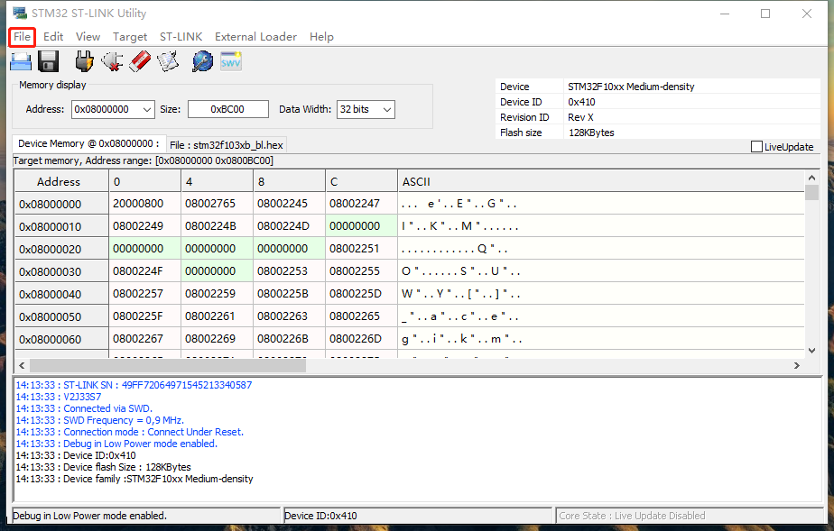
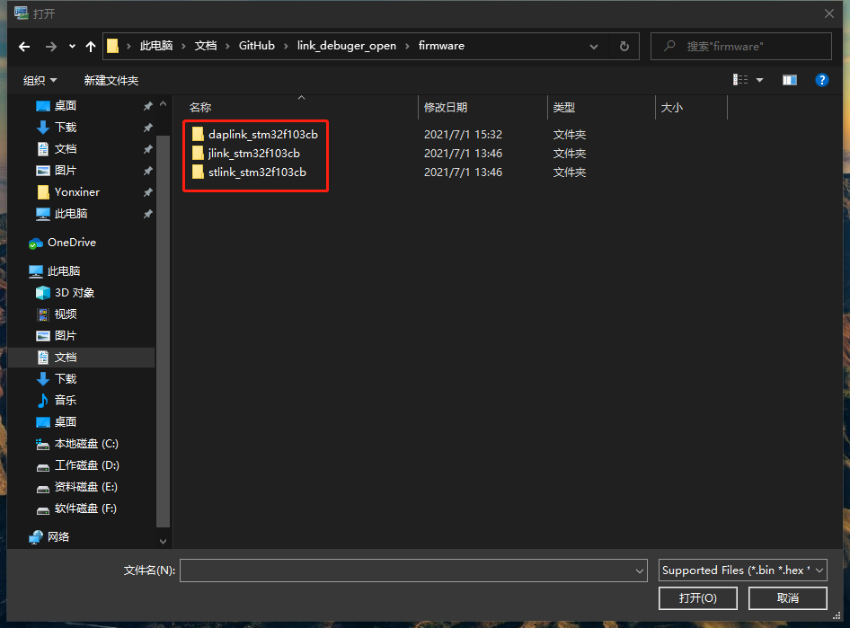
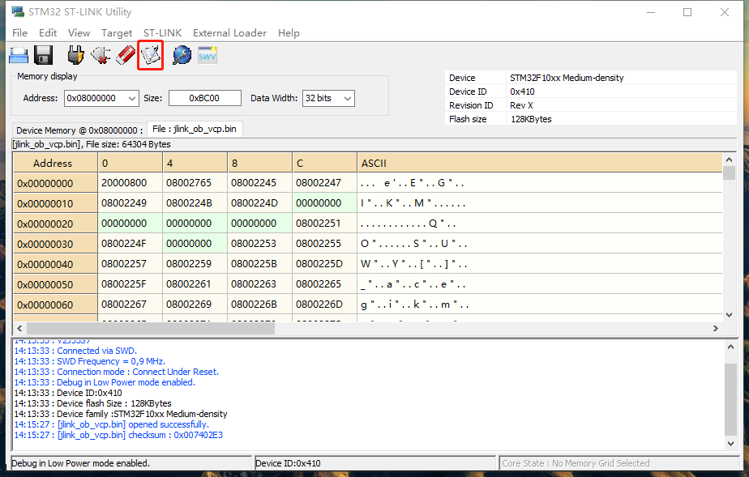
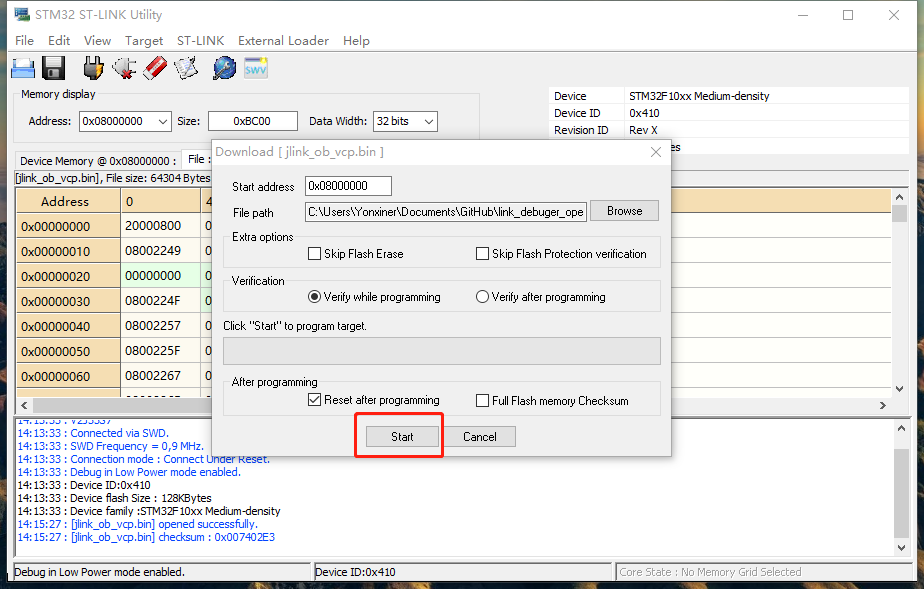
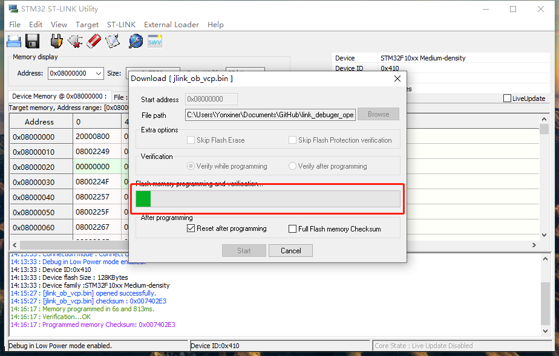

# link_debuger_stm32
Includes STLINK JLINK DAPLINK, used for microcontroller debugging.
## 简介
本项目是一个link debuger，用于调试带有JTAG、SWD接口的微控制器。由于SWD接口的优势，以及本项目宗旨是做一个美观、小巧、功能全的调试器，因此查阅了许多开源电路、开源固件。最终做了该PCB。由上下两层PCB通过铜柱连接在一起。铜柱复用为上下板供电线路。
#### 优点
- 小巧、多功能
- 插针隐藏设计、方便携带
- 支持Jlink、STlink、DAPlink
- 支持RS485调试
- 支持ESP32等IC的自动下载（RTS、DTR信号预留）
- 使用Typec接口的对称性改成SWD、UART信号接口
- 采用底板顶板贴合设计、铜柱复用电源连接底板顶板
#### 实物展示

#### **底板3D图**

## 功能
1. debuger（jlink、stlink、daplink任意中的一种）
	- SWD接口下载和调试功能
	- link虚拟的串口功能（需要jlink、stlink、daplink固件支持）
	- link支持拖拽下载（需要jlink、stlink、daplink固件支持）
2. USB转UART（CP2102虚拟的串口）
3. USB转RS485（RS485由CP2102的UART电平转化，同一时刻只使用一种，EN接通使用RS485，不接使用UART）
4. USB HUB（可以再接入其他1个USB设备，TYPEC接口）
5. 信号线交叉硬件设计
## 功能说明
- link功能表示可是使用jlink、stlink、daplink任意一种固件，烧录入不同的link固件，该设备就是可以实现变身。
- USB转串口功能，因为三种固件都支持虚拟UART功能，因此都可以使用USB转UART（TTL），下载、调试、UART调试集一身。
- 除了固件虚拟的UART，再接入一个CP2102虚拟一个串口，该串口主要引出RTS、DTR信号，在目标板上合理设计可以自动下载ESP32、STM32串口下载。
- 还将CP2102虚拟的UART（TTL）进行电平转换后得到RS485接口，用于RS485调试
- 在输入USB接口之后绘制了一个USB HUB芯片，芯片是支持一拖四USB HUB，速率达到USB2.0。可通过电阻选择USB HUB是否使用。设计成可选择，主要防止USB HUB的不稳定造成link debugger的不稳定，如USB HUB不稳定或者不使用，可进行硬件上的切换。切换方式通过丝印在背面。
- 信号线交叉设计主要用于在电路设计时大意将例如UART的RX、TX接错时可切换debuger的电阻即可。切换方式通过丝印在背面。
- 本设计接口使用了typec USB接口定义了SWD接口、UART接口。在设计你的原型电路时，可以使用typec USB来设计SWD、UART接口后，通过typec USB线连接PC、link debuger、原型电路即可开始下载与调试。
- 该设备输出共四个typec USB：
  - typec USB1：SWD、UART接口
  - typec USB2：固件虚拟的UART接口 
  - typec USB3：CP2102虚拟的UART接口，带DTR、RTS信号
  - typec USB4：USB HUB接口
### **接口定义**

## 支持固件类型
1. jlink
2. stlink
3. daplink
## 支持接口与定义
说明：个人觉得嵌入式开发调试接口20PIN的牛角座端子太大，不适合在开发板或者项目电路板上使用，直接使用插针的方式在电路板使用，当迁移电路板后需要再次每根杜邦线连接，累~，在USB接口定义有可以直接使用的线和接口，因此我想使用USB线来做我们SWD、UART接口的使用。
我在之后的电路板、自绘开发上直接使用TYPEC接口母座来连接SWD、UART接口后，使用TYPEC线连接link_debuger和电路板即可开始使用。因此有了以下将USB接口信号改成SWD、UART接口的定义。
利用TYPEC正反插时的对称性。
1. typec USB类型的SWD&UART支持接口：
	- VCC、SCK、SWD、SWO、RST、TX、RX、GND
	- 接口对应
        | TYPEC母座信号定义 | 自定义SWD、UART信号 |
        | :---: | :---: |
        | VBUS | VCC |
        | D+(DP) | SCK（可与SWD交换） |
        | D-(DN) | SWD（可与SCK交换） |
        | TX1-&TX2- | RST |
        | RX1-&RX2-  | SWO |
        | TX1+&TX2+ | TX（可与RX交换） |
        | RX1+&RX2+ | RX（可与TX交换） |
        | GND | GND |

2. typec USB类型的UART
	- VCC、TX、RX、GND
	- 接口对应说明
        | TYPEC母座信号定义 | 自定义SWD、UART信号 |
        | :---: | :---: |
        | VBUS | VCC |
        | D-(DN) | TX（可与RX交换） |
        | D+(DP) | RX（可与TX交换） |
        | GND | GND |
3. typec USB类型的UART，带DTR、RTS信号
	- VCC、TX、RX、RTS、DTR、GND
	- 接口对应说明
        | TYPEC母座信号定义 | 自定义SWD、UART信号 |
        | :---: | :---: |
        | VBUS | VCC |
        | D-(DN) | RX（可与TX交换） |
        | D+(DP) | TX（可与RX交换） |
        | TX1+&TX2+ | DTR |
        | RX1+&RX2+ | RTS |
        | GND | GND |
4. typec USB类型的USB HUB2.0
	- 5.0V、D+、D-、GND
5. 2.54间距8PIN的SWD&UART接口
	- VCC、SCK、SWD、SWO、RST、TX、RX、GND
6. 2.54间距6PIN的UART接口
	- VCC、TX、RX、RTS、DTR、GND
7. 2.54间距2PIN的RS485接口（EN接通使用RS485，不接使用UART）
	- A、B
8. 2.54间距6PIN的供电
	- 3.3V、3.3V、5.0V、5.0V、GND、GND
9. 20PIN的JTAG接口（只支持SWD，默认不焊接，焊接20PIN贴片插针或者牛角座即可使用）
### **2.54间距接口图**

## 固件切换
1. 使用自己的STLINK与link_debuger的5.0V、SWD、SCK、GND连接。
2. 打开STM32 ST-LINK Utility
3. 连接设备

4. 打开文件

5. 选择固件（DAP选择bootloader）

6. 开始编程

7. 点击start、等待进度条完成后即可使用

作者：fzxhub
