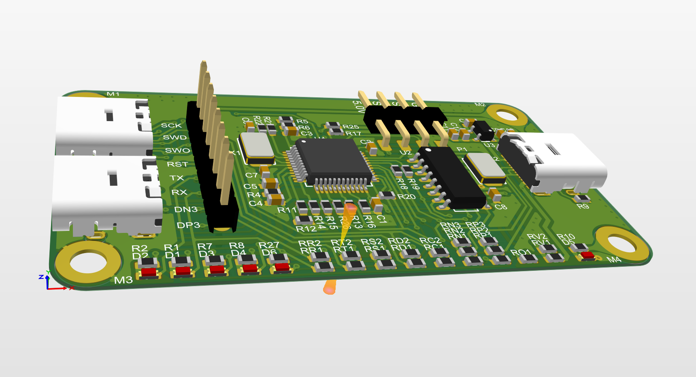
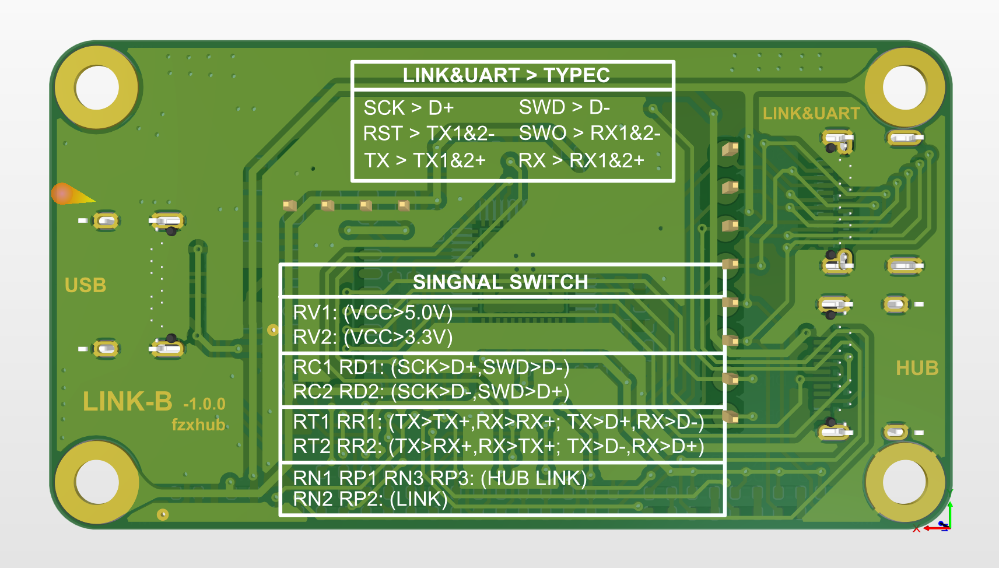
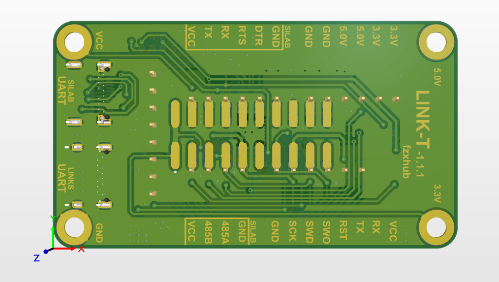

# link_debuger_stm32
Includes STLINK JLINK DAPLINK, used for microcontroller debugging.
## 简介
本项目是一个link debuger，用于调试带有JTAG、SWD接口的微控制器。由于SWD接口的优势，以及本项目宗旨是做一个美观、小巧、功能全的调试器，因此查阅了许多开源电路、开源固件。最终做了该PCB。由上下两层PCB通过铜柱连接在一起。铜柱复用为上下板供电线路。
#### **底板**

#### **顶板**

## 功能
1. debuger（jlink、stlink、daplink任意中的一种）
2. USB转UART（虚拟串口）
3. USB转RS485（RS485由UART电平转化，因此同一时刻只使用其中一种）
4. USB HUB（可以再接入其他2个USB设备）
5. 信号线交叉硬件设计
## 功能说明
- link功能表示可是使用jlink、stlink、daplink任意一种固件，烧录入不同的link固件，该设备就是可以实现变身。
- USB转串口功能，因为三种固件都支持虚拟UART功能，因此都可以使用USB转UART（TTL），下载、调试、UART调试集一身。
- 还将固件虚拟的UART（TTL）进行电平转换后得到RS485接口
- 在输入USB接口之后绘制了一个USB HUB芯片，芯片是支持一拖四USB HUB，速率达到USB2.0。可通过电阻选择USB HUB是否使用。设计成可选择，主要防止USB HUB的不稳定造成link debugger的不稳定，如USB HUB不稳定或者不使用，可进行硬件上的切换。切换方式通过丝印在背面。
- 信号线交叉设计主要用于在电路设计时大意将例如UART的RX、TX接错时可切换debuger的电阻即可。切换方式通过丝印在背面。
- 本设计接口使用了typec USB接口定义了SWD接口、UART接口。在设计你的原型电路时，可以使用typec USB来设计SWD、UART接口后，通过typec USB线连接PC、link debuger、原型电路即可开始下载与调试。
	- 该设备输出共四个typec USB：
	- typec USB1：SWD、UART接口
	- typec USB2：UART接口 
	- typec USB3：USB HUB接口
	- typec USB4：USB HUB接口
### **接口定义**

## 支持固件类型
1. jlink
2. stlink
3. daplink
## 支持接口
1. typec USB类型的SWD、UART接口
2. typec USB类型的UART
3. typec USB类型的USB HUB2.0
4. 6PIN的SWD接口
5. 4PIN的UART接口
6. 4PIN的RS485接口
7. 4PIN的3.3V供电
8. 4PIN的5V供电
9. 20PIN的JTAG接口（只支持SWD，默认不焊接，焊接20PIN贴片插针或者牛角座即可使用）
### **部分接口图**

## 固件切换
1. 切换jlink
	-
2. 切换stlink
	-
3. 切换daplink
	-

作者：fzxhub
